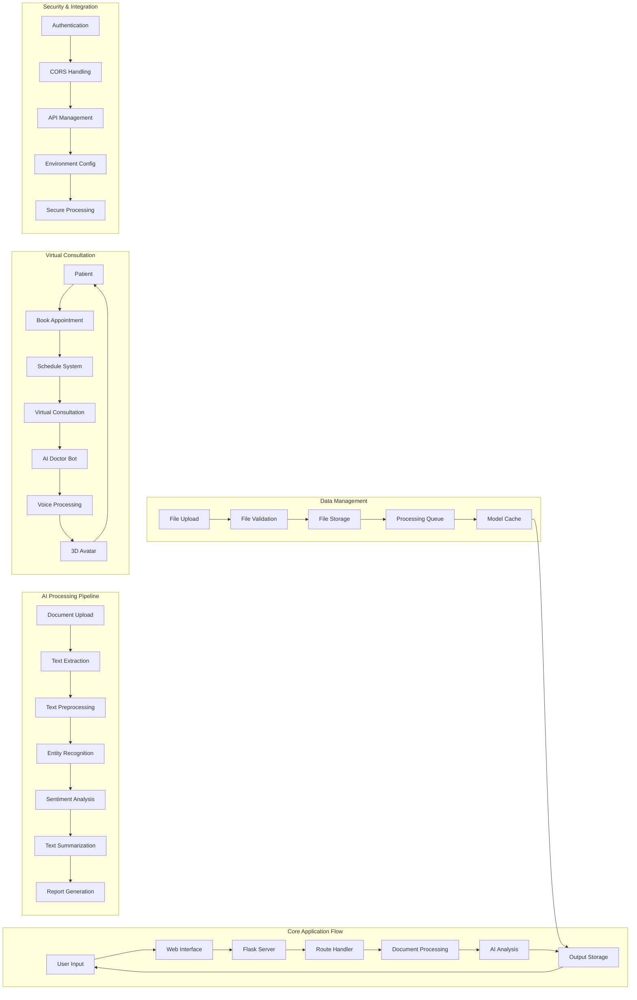

# HealthSummarizeAI System Architecture Diagram

## Complete System Architecture

```mermaid
graph TB
    %% User Interface Layer
    subgraph "User Interface Layer"
        UI[Web Interface<br/>HTML5/CSS3/JS]
        AV[3D Avatar Interface<br/>Virtual Consultation]
        MOB[Mobile Interface<br/>Future Implementation]
    end

    %% Application Layer
    subgraph "Application Layer"
        subgraph "Flask Web Server"
            APP[Flask Application<br/>Port 600]
            ROUTES[Route Handlers<br/>Blueprint System]
            SOCKET[SocketIO<br/>Real-time Communication]
        end
        
        subgraph "PyQt5 Desktop App"
            QT[PyQt5 Application<br/>QWebEngineView]
            QT_WEB[Embedded Web View<br/>Flask Integration]
        end
    end

    %% AI/ML Processing Layer
    subgraph "AI/ML Processing Layer"
        subgraph "NLP Pipeline"
            NER[BioBERT NER Model<br/>Medical Entity Recognition]
            SENT[Sentiment Analysis<br/>Longformer Model]
            SUM[T5 Summarization<br/>Text Summarization]
            GPT[GPT-2 Model<br/>Text Generation]
        end
        
        subgraph "Medical Analysis"
            MED_NLP[Medical NLP Pipeline<br/>Document Processing]
            IMG_ANAL[Medical Image Analysis<br/>BLIP Model]
            DIAG[Diagnostic Reasoning<br/>Symptom Matching]
        end
        
        subgraph "AI Bot"
            AI_BOT[AI Doctor Bot<br/>Virtual Consultation]
            VOICE[Voice Processing<br/>Speech Recognition]
            AVATAR[3D Avatar Generation<br/>Video Synthesis]
        end
    end

    %% Data Layer
    subgraph "Data Layer"
        subgraph "Databases"
            SQLITE[SQLite Database<br/>Appointments]
            FIREBASE[Firebase Firestore<br/>Real-time Data]
        end
        
        subgraph "File Storage"
            UPLOADS[Upload Directory<br/>Medical Documents]
            MODELS[Model Cache<br/>Hugging Face Models]
            REPORTS[Report Outputs<br/>Generated Reports]
            VIDEOS[Avatar Videos<br/>3D Avatar Assets]
        end
        
        subgraph "Knowledge Base"
            MED_KB[Medical Knowledge Base<br/>Conditions & Treatments]
            EHR_DATA[EHR Datasets<br/>Training Data]
        end
    end

    %% External Services
    subgraph "External Services"
        OPENAI[OpenAI API<br/>GPT Models]
        ELEVEN[ElevenLabs API<br/>Voice Synthesis]
        RAPID[RapidAPI<br/>Medical APIs]
        GOOGLE[Google Cloud<br/>Speech Recognition]
    end

    %% Security & Configuration
    subgraph "Security & Config"
        ENV[Environment Variables<br/>API Keys & Config]
        CORS[CORS Configuration<br/>Cross-origin Access]
        CACHE[Flask Caching<br/>Performance Optimization]
    end

    %% Data Flow Connections
    UI --> APP
    AV --> APP
    MOB -.-> APP
    
    APP --> ROUTES
    ROUTES --> SOCKET
    APP --> QT_WEB
    
    ROUTES --> MED_NLP
    ROUTES --> AI_BOT
    ROUTES --> IMG_ANAL
    
    MED_NLP --> NER
    MED_NLP --> SENT
    MED_NLP --> SUM
    MED_NLP --> GPT
    
    AI_BOT --> VOICE
    AI_BOT --> AVATAR
    AI_BOT --> DIAG
    
    APP --> SQLITE
    APP --> FIREBASE
    APP --> UPLOADS
    APP --> MODELS
    APP --> REPORTS
    APP --> VIDEOS
    
    MED_NLP --> MED_KB
    MED_NLP --> EHR_DATA
    
    AI_BOT --> OPENAI
    VOICE --> GOOGLE
    AVATAR --> ELEVEN
    ROUTES --> RAPID
    
    APP --> ENV
    APP --> CORS
    APP --> CACHE

    %% Styling
    classDef userInterface fill:#e1f5fe,stroke:#01579b,stroke-width:2px
    classDef application fill:#f3e5f5,stroke:#4a148c,stroke-width:2px
    classDef aiLayer fill:#e8f5e8,stroke:#1b5e20,stroke-width:2px
    classDef dataLayer fill:#fff3e0,stroke:#e65100,stroke-width:2px
    classDef external fill:#fce4ec,stroke:#880e4f,stroke-width:2px
    classDef security fill:#f1f8e9,stroke:#33691e,stroke-width:2px

    class UI,AV,MOB userInterface
    class APP,ROUTES,SOCKET,QT,QT_WEB application
    class NER,SENT,SUM,GPT,MED_NLP,IMG_ANAL,DIAG,AI_BOT,VOICE,AVATAR aiLayer
    class SQLITE,FIREBASE,UPLOADS,MODELS,REPORTS,VIDEOS,MED_KB,EHR_DATA dataLayer
    class OPENAI,ELEVEN,RAPID,GOOGLE external
    class ENV,CORS,CACHE security
```

## Detailed Component Architecture

## Technology Stack Architecture

```mermaid
graph TB
    %% Frontend Technologies
    subgraph "Frontend Stack"
        HTML[HTML5]
        CSS[CSS3/Bootstrap]
        JS[JavaScript/jQuery]
        AVATAR_UI[3D Avatar Interface]
    end

    %% Backend Technologies
    subgraph "Backend Stack"
        PYTHON[Python 3.x]
        FLASK[Flask Framework]
        SOCKETIO[SocketIO]
        PYQT5[PyQt5 Desktop]
    end

    %% AI/ML Technologies
    subgraph "AI/ML Stack"
        TRANSFORMERS[Hugging Face Transformers]
        TORCH[PyTorch]
        TENSORFLOW[TensorFlow]
        SPACY[spaCy NLP]
    end

    %% Database Technologies
    subgraph "Database Stack"
        SQLITE[SQLite]
        FIREBASE[Firebase Firestore]
        CACHE[Flask Caching]
    end

    %% External APIs
    subgraph "External APIs"
        OPENAI_API[OpenAI API]
        ELEVENLABS[ElevenLabs API]
        RAPIDAPI[RapidAPI]
        GOOGLE_CLOUD[Google Cloud Speech]
    end

    %% Deployment & Infrastructure
    subgraph "Infrastructure"
        LOCAL[Local Development]
        CLOUD[Cloud Deployment]
        DOCKER[Docker Containerization]
    end

    %% Connections
    HTML --> PYTHON
    CSS --> PYTHON
    JS --> PYTHON
    AVATAR_UI --> PYTHON
    
    PYTHON --> TRANSFORMERS
    PYTHON --> TORCH
    PYTHON --> TENSORFLOW
    PYTHON --> SPACY
    
    PYTHON --> SQLITE
    PYTHON --> FIREBASE
    PYTHON --> CACHE
    
    PYTHON --> OPENAI_API
    PYTHON --> ELEVENLABS
    PYTHON --> RAPIDAPI
    PYTHON --> GOOGLE_CLOUD
    
    PYTHON --> LOCAL
    PYTHON --> CLOUD
    PYTHON --> DOCKER
```

## Key Features & Capabilities

### 1. **Document Processing Pipeline**
- PDF, TXT, JSON file support
- OCR for image-based documents
- Text extraction and preprocessing
- Medical entity recognition using BioBERT

### 2. **AI-Powered Analysis**
- Named Entity Recognition (NER) for medical terms
- Sentiment analysis for patient narratives
- Text summarization using T5 model
- GPT-2 based text generation

### 3. **Virtual Consultation System**
- AI Doctor Bot for patient interactions
- Voice processing and synthesis
- 3D avatar generation
- Real-time appointment management

### 4. **Data Management**
- SQLite for local appointment storage
- Firebase Firestore for real-time data
- Secure file upload and storage
- Model caching for performance

### 5. **Security & Compliance**
- HIPAA-compliant data handling
- Environment-based configuration
- CORS protection
- Secure API key management

### 6. **Multi-Platform Support**
- Web interface (Flask)
- Desktop application (PyQt5)
- Mobile-ready responsive design
- Real-time communication (SocketIO)

This architecture demonstrates a comprehensive healthcare AI platform that combines modern web technologies with advanced AI/ML capabilities to provide intelligent medical document processing and virtual consultation services. 