# **Medivance.AI: Revolutionizing Healthcare Documentation** 🏥✨
<!-- Medivance.AI Banner -->
<p align="center">
  
</p>

<h1 align="center">
  <span style="background: linear-gradient(90deg, #1a73e8 0%, #00bfae 100%); -webkit-background-clip: text; -webkit-text-fill-color: transparent; color: #1a73e8;">
    Medivance.AI
  </span>
  <br>
  
</h1>

<p align="center">
  <b>Revolutionizing Healthcare with AI-Powered Summarization, Medical Analysis, and Virtual Consultations</b>
  <br>
  <br>
  
  
  
  
  
</p>

---

<p align="center">
  
  
</p>

---

---

## ❗🏥 Problem Statement :


How might we revolutionize the way healthcare data is managed, accessed, and utilized?

Today’s healthcare system is drowning in data—massive volumes of medical records, imaging, and real-time consultation notes are generated every day. Yet, manual documentation remains slow and error-prone, contributing to physician burnout and inefficiency. Patients are often left in the dark, unable to easily access or understand their own health information. Disconnected systems—EHRs, imaging platforms, and telehealth tools—create silos, leading to fragmented care and delayed decisions. On top of this, data privacy, regulatory compliance, and secure communication between patients and providers are ongoing challenges.

**Your mission:** Build innovative solutions that break down these barriers. Can you create a platform that streamlines documentation, empowers patients, integrates data sources, and ensures security and compliance—all while delivering a seamless healthcare experience?

## 🩻💉💡 What Are We Solving? :

Medivance.AI addresses these challenges by providing an all-in-one AI-powered platform that:

<table>
  <tr>
    <td width="40" align="center">📝</td>
    <td>
      <b>Intelligent EHR Summarization</b><br>
      <i>“Cut through the clutter.”</i> <br>
      Instantly distills complex medical records into clear, actionable summaries—no more paperwork headaches, just the facts clinicians need.
    </td>
  </tr>
  <tr>
    <td align="center">🩻</td>
    <td>
      <b>Medisync: AI Imaging & Diagnostics</b><br>
      <i>“See beyond the surface.”</i> <br>
      Analyzes X-rays and scans in a flash, spotlighting critical findings and delivering instant, crystal-clear diagnostic reports.
    </td>
  </tr>
  <tr>
    <td align="center">💻</td>
    <td>
      <b>Virtual Consultations & Smart Scheduling</b><br>
      <i>“Care at your fingertips.”</i> <br>
      Book, verify, and join secure online appointments—no waiting rooms, just seamless, real-time connections between patients and providers.
    </td>
  </tr>
  <tr>
    <td align="center">📰</td>
    <td>
      <b>AI-Curated Medical News & Insights</b><br>
      <i>“Stay ahead of the curve.”</i> <br>
      Delivers the latest, most relevant healthcare news—filtered by AI, tailored to you, and always up-to-date.
    </td>
  </tr>
  <tr>
    <td align="center">🔒</td>
    <td>
      <b>End-to-End Security & Compliance</b><br>
      <i>“Your data, ironclad.”</i> <br>
      Fortifies privacy with robust encryption, HIPAA compliance, and multi-factor ID checks—trust and safety, built in.
    </td>
  </tr>
</table>

<p align="center">
  <b>Medivance.AI bridges the gap between data, diagnostics, and care—empowering everyone in healthcare to achieve more, together.</b>
</p>

---

## 🎬 Video Walkthrough

> **Coming Soon:** A full video demo will be available to showcase Medivance.AI in action!

---

## 🌟 What is Medivance.AI?

Medivance.AI is a **cutting-edge, all-in-one AI healthcare platform** that transforms the way patients, doctors, and healthcare organizations interact with medical data.  
It’s not just about summarizing EHRs—Medivance.AI brings together:

- **AI-powered EHR Summarization**
- **Medisync: End-to-End Medical Imaging, Diagnostics & Report Generation System**
- **Doctor & Professional Verification**
- **Virtual Appointment & Consultation System**
- **Secure, HIPAA-compliant Data Handling**
- **Real-time Medical News & Insights**

All in a single, modern, and intuitive web application.

---

## ✨ Key Features

<table>
  <tr>
    <td width="50"></td>
    <td><b>Doctor & Professional Verification</b><br>Book appointments, verify your identity, and connect with certified healthcare professionals for real consultations.</td>
  </tr>
  <tr>
    <td></td>
    <td><b>AI-Powered EHR Summarization</b><br>Upload your medical records and get clear, structured, and clinically accurate summaries using advanced NLP models.</td>
  </tr>
  <tr>
    <td></td>
    <td><b>Medisync</b><br>An  End-to-End Medical Imaging, Diagnostics & Report Generation System that Analyze , enhance  X-ray scans and medical images with AI for instant, actionable insights and also generated the corresponding report for patients well-being and also help the healthcare professionals to manage the patients health records.</td>
  </tr>
  <tr>
    <td></td>
    <td><b>Virtual Consultation Workflow</b><br>Schedule, validate, and complete appointments online. Join virtual consultations and receive AI-generated reports.</td>
  </tr>
  <tr>
    <td></td>
    <td><b>Sentiment & Entity Analysis</b><br>Understand the emotional and clinical context of your medical narratives with advanced AI.</td>
  </tr>
  <tr>
    <td></td>
    <td><b>HIPAA-Grade Security</b><br>All data is encrypted and handled with strict compliance and privacy standards.</td>
  </tr>
  <tr>
    <td></td>
    <td><b>AI-Curated Health News</b><br>Stay updated with the latest, AI-curated news in healthcare, research, and innovation and HealthTech.</td>
  </tr>
</table>

---

## 🏗️ System Architecture

```mermaid
%%{init: {
  'theme': 'base',
  'themeVariables': {
    'fontFamily': 'Inter, Segoe UI, Arial',
    'fontSize': '18px',
    'lineColor': '#334155',
    'textColor': '#0f172a',
    'primaryColor': '#e0f2fe',
    'primaryBorderColor': '#0284c7',
    'primaryTextColor': '#0c4a6e',
    'secondaryColor': '#f3e8ff',
    'secondaryBorderColor': '#7c3aed',
    'tertiaryColor': '#ecfdf5',
    'tertiaryBorderColor': '#10b981',
    'clusterBkg': '#f8fafc',
    'clusterBorder': '#94a3b8',
    'edgeLabelBackground': '#ffffff'
  },
  'flowchart': {
    'diagramPadding': 16,
    'nodeSpacing': 60,
    'rankSpacing': 90,
    'htmlLabels': true,
    'curve': 'basis',
    'padding': 12,
    'useMaxWidth': false
  }
}%%

graph TD

    %% User Interface Layer
    subgraph "User Interface Layer"
        direction TB
        UI_CORE((UI Layer))
        UI[Web Interface<br/>HTML5/CSS3/JS]
        AV[3D Avatar Interface<br/>Virtual Consultation]
        MOB[Mobile Interface<br/>Future Implementation]
        UI_CORE --> UI
        UI_CORE --> AV
        UI_CORE --> MOB
    end

    %% Application Layer
    subgraph "Application Layer"
        direction TB
        APP_CORE((App Layer))
        subgraph "Flask Web Server"
            direction TB
            APP[Flask Application<br/>Port 600]
            ROUTES[Route Handlers<br/>Blueprint System]
            SOCKET[SocketIO<br/>Real-time Communication]
        end
        
        subgraph "PyQt5 Desktop App"
            direction TB
            QT[PyQt5 Application<br/>QWebEngineView]
            QT_WEB[Embedded Web View<br/>Flask Integration]
        end
        APP_CORE --> APP
        APP_CORE --> ROUTES
        APP_CORE --> SOCKET
        APP_CORE --> QT
        APP_CORE --> QT_WEB
    end

    %% AI/ML Processing Layer
    subgraph "AI/ML Processing Layer"
        direction TB
        AI_CORE((AI/ML Layer))
        subgraph "NLP Pipeline"
            direction TB
            NER[BioBERT NER Model<br/>Medical Entity Recognition]
            SENT[Sentiment Analysis<br/>Longformer Model]
            SUM[T5 Summarization<br/>Text Summarization]
            GPT[GPT-2 Model<br/>Text Generation]
        end
        
        subgraph "Medical Analysis"
            direction TB
            MED_NLP[Medical NLP Pipeline<br/>Document Processing]
            IMG_ANAL[Medical Image Analysis<br/>BLIP Model]
            DIAG[Diagnostic Reasoning<br/>Symptom Matching]
        end
        
        subgraph "AI Bot"
            direction TB
            AI_BOT[AI Doctor Bot<br/>Virtual Consultation]
            VOICE[Voice Processing<br/>Speech Recognition]
            AVATAR[3D Avatar Generation<br/>Video Synthesis]
        end
        AI_CORE --> NER
        AI_CORE --> SENT
        AI_CORE --> SUM
        AI_CORE --> GPT
        AI_CORE --> MED_NLP
        AI_CORE --> IMG_ANAL
        AI_CORE --> DIAG
        AI_CORE --> AI_BOT
        AI_CORE --> VOICE
        AI_CORE --> AVATAR
    end

    %% Data Layer
    subgraph "Data Layer"
        direction TB
        DATA_CORE((Data Layer))
        subgraph "Databases"
            direction TB
            SQLITE[SQLite Database<br/>Appointments]
            FIREBASE[Firebase Firestore<br/>Real-time Data]
        end
        
        subgraph "File Storage"
            direction TB
            UPLOADS[Upload Directory<br/>Medical Documents]
            MODELS[Model Cache<br/>Hugging Face Models]
            REPORTS[Report Outputs<br/>Generated Reports]
            VIDEOS[Avatar Videos<br/>3D Avatar Assets]
        end
        
        subgraph "Knowledge Base"
            direction TB
            MED_KB[Medical Knowledge Base<br/>Conditions & Treatments]
            EHR_DATA[EHR Datasets<br/>Training Data]
        end
        DATA_CORE --> SQLITE
        DATA_CORE --> FIREBASE
        DATA_CORE --> UPLOADS
        DATA_CORE --> MODELS
        DATA_CORE --> REPORTS
        DATA_CORE --> VIDEOS
        DATA_CORE --> MED_KB
        DATA_CORE --> EHR_DATA
    end

    %% External Services
    subgraph "External Services"
        direction TB
        EXT_CORE((External Services))
        OPENAI[OpenAI API<br/>GPT Models]
        ELEVEN[ElevenLabs API<br/>Voice Synthesis]
        RAPID[RapidAPI<br/>Medical APIs]
        GOOGLE[Google Cloud<br/>Speech Recognition]
        EXT_CORE --> OPENAI
        EXT_CORE --> ELEVEN
        EXT_CORE --> RAPID
        EXT_CORE --> GOOGLE
    end

    %% Security & Configuration
    subgraph "Security & Config"
        direction TB
        SEC_CORE((Security & Config))
        ENV[Environment Variables<br/>API Keys & Config]
        CORS[CORS Configuration<br/>Cross-origin Access]
        CACHE[Flask Caching<br/>Performance Optimization]
        SEC_CORE --> ENV
        SEC_CORE --> CORS
        SEC_CORE --> CACHE
    end

    %% Data Flow Connections
    UI_CORE --> APP_CORE
    
    APP --> ROUTES
    ROUTES --> SOCKET
    APP_CORE --> QT_WEB
    
    APP_CORE --> MED_NLP
    APP_CORE --> AI_BOT
    APP_CORE --> IMG_ANAL
    
    MED_NLP -. feeds .-> NER
    MED_NLP -. feeds .-> SENT
    MED_NLP -. feeds .-> SUM
    MED_NLP -. feeds .-> GPT
    
    AI_BOT -. uses .-> VOICE
    AI_BOT -. uses .-> AVATAR
    AI_BOT -. uses .-> DIAG
    
    APP_CORE --> DATA_CORE
    
    MED_NLP --> MED_KB
    MED_NLP --> EHR_DATA
    
    AI_BOT --> OPENAI
    VOICE --> GOOGLE
    AVATAR --> ELEVEN
    APP_CORE --> RAPID
    
    APP_CORE --> SEC_CORE

    %% Styling
    classDef userInterface fill:#e0f2fe,stroke:#0284c7,stroke-width:3px,color:#0c4a6e
    classDef application fill:#f3e8ff,stroke:#7c3aed,stroke-width:3px,color:#4c1d95
    classDef aiLayer fill:#ecfdf5,stroke:#10b981,stroke-width:3px,color:#064e3b
    classDef dataLayer fill:#fff7ed,stroke:#ea580c,stroke-width:3px,color:#7c2d12
    classDef external fill:#fce7f3,stroke:#be185d,stroke-width:3px,color:#831843
    classDef security fill:#f1f5f9,stroke:#334155,stroke-width:3px,color:#0f172a

    class UI,AV,MOB userInterface
    class APP,ROUTES,SOCKET,QT,QT_WEB application
    class NER,SENT,SUM,GPT,MED_NLP,IMG_ANAL,DIAG,AI_BOT,VOICE,AVATAR aiLayer
    class SQLITE,FIREBASE,UPLOADS,MODELS,REPORTS,VIDEOS,MED_KB,EHR_DATA dataLayer
    class OPENAI,ELEVEN,RAPID,GOOGLE external
    class ENV,CORS,CACHE security
```



<br>
<br>
<br>

**🏹🎯 Model Pipeline Arcitecture:**

```

┌───────────────────────────────────────────────────────────────────────────┐
│                                                                           │
│                         AI Doctor Model Pipeline                          │
│                                                                           │
└───────────────────────────────────────────────────────────────────────────┘
                                    │
                                    ▼
┌───────────────────────────────────────────────────────────────────────────┐
│                       Input Processing & NLU Module                       │
│                                                                           │
│  - Symptom extraction                                                     │
│  - Medical entity recognition                                             │
│  - Patient intent classification                                          │
│  - Medical context understanding                                          │
│                                                                           │
└────────────────────────────────────┬──────────────────────────────────────┘
                                     │
                                     ▼
┌───────────────────────────────────────────────────────────────────────────┐
│                        Diagnostic Reasoning Module                        │
│                                                                           │
│  - Symptom-disease matching                                               │
│  - Medical knowledge retrieval                                            │
│  - Differential diagnosis generation                                      │
│  - Confidence scoring                                                     │
│                                                                           │
└────────────────────────────────────┬──────────────────────────────────────┘
                                     │
                                     ▼
┌───────────────────────────────────────────────────────────────────────────┐
│                      Treatment Recommendation Module                      │
│                                                                           │
│  - Treatment protocol retrieval                                           │
│  - Medication suggestion                                                  │
│  - Lifestyle recommendation                                               │
│  - Dietary advice generation                                              │
│                                                                           │
└────────────────────────────────────┬──────────────────────────────────────┘
                                     │
                                     ▼
┌───────────────────────────────────────────────────────────────────────────┐
│                       Response Generation Module                          │
│                                                                           │
│  - Medical report formatting                                              │
│  - Patient-friendly explanation                                           │
│  - Appropriate disclaimer addition                                        │
│  - Referral generation when needed                                        │
│                                                                           │
└────────────────────────────────────┬──────────────────────────────────────┘
                                     │
                                     ▼
┌───────────────────────────────────────────────────────────────────────────┐
│                        Safety & Compliance Module                         │
│                                                                           │
│  - Critical condition detection                                           │
│  - Emergency warning generation                                           │
│  - Medical ethics compliance                                              │
│  - Regulatory adherence                                                   │
│                                                                           │
└───────────────────────────────────────────────────────────────────────────┘

```

- **Frontend:** HTML5, CSS3 (Bootstrap, Tailwind), JavaScript, Animate.css, AOS
- **Backend:** Python 3.x, Flask, RESTful APIs, SocketIO
- **AI/ML:** Hugging Face Transformers (BioBERT, T5, GPT-2, Longformer), BLIP for image analysis, spaCy
- **Database:** Firebase Firestore (real-time), SQLite (local)
- **Cloud & APIs:** Google Cloud, OpenAI, ElevenLabs, RapidAPI

> For a detailed architecture, see [System Architecture Diagram](Flow-Diagrams/system_architecture_diagram.md)

---

## 👤 Who Is Medivance.AI For?

| 👨‍⚕️ Medical Practitioners | 🏥 Healthcare Facilities | 📊 Medical Researchers | 👩‍💼 Healthcare Administrators | 🧑‍💻 Patients |
|:-------------------------:|:-----------------------:|:---------------------:|:-----------------------------:|:------------:|
| Streamline documentation, automate analysis, and collaborate with patients. | Manage appointments, records, and AI-powered workflows. | Analyze large datasets, extract insights, and accelerate research. | Oversee secure, efficient, and compliant healthcare operations. | Get your records analyzed, book appointments, and consult with real doctors. |

---

## 🚦 Complete Workflow

1. **Book Appointment:**  
   Patients schedule appointments with doctors via the web portal.

2. **Verify & Start Consultation:**  
   Enter your appointment ID to begin a virtual consultation. The system verifies your identity and appointment details.

3. **AI Analysis:**  
   Upload X-ray images or medical documents. The AI analyzes and summarizes your records, providing instant feedback.

4. **End Consultation:**  
   Doctors and patients can mark appointments as complete. Reports are securely stored and accessible for future reference.

5. **Review & Download Reports:**  
   Access structured summaries, sentiment analysis, and diagnostic suggestions from your dashboard.

> See the [COMPLETE_WORKFLOW_GUIDE](hugging-face-feature-docs/COMPLETE_WORKFLOW_GUIDE.md) for a step-by-step guide.

---

## 🛠️ Getting Started

<details>
<summary><b>Quickstart (Local Development)</b></summary>

1. **Clone the Repository**
   ```bash
   git clone https://github.com/Blacksujit/HealthSummarizeAI.git
   ```

2. **Install Dependencies**
   ```bash
   pip install -r requirements.txt
   ```

3. **Run the Application**
   ```bash
   flask run --port=600
   ```

4. **Access the Platform**  
   Open [http://localhost:600](http://localhost:600) in your browser.

</details>

---

## 🧠 Technologies Used

<p align="center">
  
  
  
  
  
  
  
</p>

---

## 📱 Roadmap & Upcoming Features

- 📱 **Mobile Application** (iOS & Android)
- 🤖 **Advanced AI Diagnostics & Recommendations**
- 🌐 **Multi-language Support**
- 📈 **Analytics Dashboard for Providers**
- 🗣️ **Real-time Chat & Voice Consultation**
- 🛡️ **Enhanced Security & Compliance**

---

## 🤝 Contributing

We welcome contributions from the community!

To contribute:
- Fork the repository and create your branch from `main`.
- Make your changes with clear, descriptive commit messages.
- Ensure your code follows our style guidelines and passes all tests.
- Submit a pull request and describe your changes in detail.
- Be respectful and constructive in code reviews and discussions.


---

## 📄 License

This project is licensed under the MIT License. See the [LICENSE](./LICENSE) file for details.

---

## 📬 Contact & Support

<p align="center">
  
</p>

For questions, support, or partnership inquiries:

- 📧 Email: [team mail](nirmalsujit861@gmail.com)

---

<p align="center" style="font-size:1.2rem;">
  <b>Empowering Healthcare Through Innovation 🌟</b> <br>
  
</p>

---

