# **Medivance.AI: Revolutionizing Healthcare Documentation** 🏥✨
<!-- Medivance.AI Banner -->
<p align="center">
  
</p>

<h1 align="center">
  <span style="background: linear-gradient(90deg, #1a73e8 0%, #00bfae 100%); -webkit-background-clip: text; -webkit-text-fill-color: transparent; color: #1a73e8;">
    Medivance.AI
  </span>
  <br>
  
</h1>

<p align="center">
  <b>Revolutionizing Healthcare with AI-Powered Summarization, Medical Analysis, and Virtual Consultations</b>
  <br>
  <br>
  
  
  
  
  
</p>

---

<p align="center">
  
  
</p>

---

---

## ❗🏥 Problem Statement :


How might we revolutionize the way healthcare data is managed, accessed, and utilized?

Today’s healthcare system is drowning in data—massive volumes of medical records, imaging, and real-time consultation notes are generated every day. Yet, manual documentation remains slow and error-prone, contributing to physician burnout and inefficiency. Patients are often left in the dark, unable to easily access or understand their own health information. Disconnected systems—EHRs, imaging platforms, and telehealth tools—create silos, leading to fragmented care and delayed decisions. On top of this, data privacy, regulatory compliance, and secure communication between patients and providers are ongoing challenges.

**Your mission:** Build innovative solutions that break down these barriers. Can you create a platform that streamlines documentation, empowers patients, integrates data sources, and ensures security and compliance—all while delivering a seamless healthcare experience?

## 🩻💉💡 What Are We Solving? :

Medivance.AI addresses these challenges by providing an all-in-one AI-powered platform that:

<table>
  <tr>
    <td width="40" align="center">📝</td>
    <td>
      <b>Intelligent EHR Summarization</b><br>
      <i>“Cut through the clutter.”</i> <br>
      Instantly distills complex medical records into clear, actionable summaries—no more paperwork headaches, just the facts clinicians need.
    </td>
  </tr>
  <tr>
    <td align="center">🩻</td>
    <td>
      <b>Medisync: AI Imaging & Diagnostics</b><br>
      <i>“See beyond the surface.”</i> <br>
      Analyzes X-rays and scans in a flash, spotlighting critical findings and delivering instant, crystal-clear diagnostic reports.
    </td>
  </tr>
  <tr>
    <td align="center">💻</td>
    <td>
      <b>Virtual Consultations & Smart Scheduling</b><br>
      <i>“Care at your fingertips.”</i> <br>
      Book, verify, and join secure online appointments—no waiting rooms, just seamless, real-time connections between patients and providers.
    </td>
  </tr>
  <tr>
    <td align="center">📰</td>
    <td>
      <b>AI-Curated Medical News & Insights</b><br>
      <i>“Stay ahead of the curve.”</i> <br>
      Delivers the latest, most relevant healthcare news—filtered by AI, tailored to you, and always up-to-date.
    </td>
  </tr>
  <tr>
    <td align="center">🔒</td>
    <td>
      <b>End-to-End Security & Compliance</b><br>
      <i>“Your data, ironclad.”</i> <br>
      Fortifies privacy with robust encryption, HIPAA compliance, and multi-factor ID checks—trust and safety, built in.
    </td>
  </tr>
</table>

<p align="center">
  <b>Medivance.AI bridges the gap between data, diagnostics, and care—empowering everyone in healthcare to achieve more, together.</b>
</p>

---

## 🎬 Video Walkthrough

> **Coming Soon:** A full video demo will be available to showcase Medivance.AI in action!

---

## 🌟 What is Medivance.AI?

Medivance.AI is a **cutting-edge, all-in-one AI healthcare platform** that transforms the way patients, doctors, and healthcare organizations interact with medical data.  
It’s not just about summarizing EHRs—Medivance.AI brings together:

- **AI-powered EHR Summarization**
- **Medisync: End-to-End Medical Imaging, Diagnostics & Report Generation System**
- **Doctor & Professional Verification**
- **Virtual Appointment & Consultation System**
- **Secure, HIPAA-compliant Data Handling**
- **Real-time Medical News & Insights**

All in a single, modern, and intuitive web application.

---

## ✨ Key Features

<table>
  <tr>
    <td width="50"></td>
    <td><b>Doctor & Professional Verification</b><br>Book appointments, verify your identity, and connect with certified healthcare professionals for real consultations.</td>
  </tr>
  <tr>
    <td></td>
    <td><b>AI-Powered EHR Summarization</b><br>Upload your medical records and get clear, structured, and clinically accurate summaries using advanced NLP models.</td>
  </tr>
  <tr>
    <td></td>
    <td><b>Medisync</b><br>An  End-to-End Medical Imaging, Diagnostics & Report Generation System that Analyze , enhance  X-ray scans and medical images with AI for instant, actionable insights and also generated the corresponding report for patients well-being and also help the healthcare professionals to manage the patients health records.</td>
  </tr>
  <tr>
    <td></td>
    <td><b>Virtual Consultation Workflow</b><br>Schedule, validate, and complete appointments online. Join virtual consultations and receive AI-generated reports.</td>
  </tr>
  <tr>
    <td></td>
    <td><b>Sentiment & Entity Analysis</b><br>Understand the emotional and clinical context of your medical narratives with advanced AI.</td>
  </tr>
  <tr>
    <td></td>
    <td><b>HIPAA-Grade Security</b><br>All data is encrypted and handled with strict compliance and privacy standards.</td>
  </tr>
  <tr>
    <td></td>
    <td><b>AI-Curated Health News</b><br>Stay updated with the latest, AI-curated news in healthcare, research, and innovation and HealthTech.</td>
  </tr>
</table>

---

## 🏗️ System Architecture

> **Medivance.AI’s architecture is engineered for performance, security, and seamless user experience. Explore the immersive, multi-layered design below:**

```mermaid
graph TB
  %% Main System Title
  TITLE["🏥 **Medivance.AI System Architecture**"]

  %% User Interface Layer
  subgraph UI_LAYER["🖥️ **User Interface Layer**"]
    UI["🌐 **Web Portal**<br/>Modern UI/UX<br/>HTML5, CSS3, JS, Bootstrap, Tailwind"]
    AVATAR["👤 **3D Avatar Interface**<br/>Virtual Consultations<br/>Real-time Interaction"]
    MOBILE["📱 **Mobile App**<br/>iOS & Android<br/>(Upcoming)"]
  end

  %% Application Layer
  subgraph APP_LAYER["⚙️ **Application Layer**"]
    FLASK["🚀 **Flask Web Server**<br/>Port 600<br/>RESTful APIs"]
    ROUTES["🛣️ **Route Handlers**<br/>Blueprints<br/>API Endpoints"]
    SOCKET["🔌 **SocketIO**<br/>Real-time Communication"]
    PYQT["💻 **PyQt5 Desktop App**<br/>QWebEngineView<br/>Native Desktop UI"]
  end

  %% AI/ML Layer
  subgraph AI_LAYER["🧠 **AI/ML Processing Layer**"]
    NLP["📝 **NLP Pipeline**<br/>BioBERT NER<br/>Longformer Sentiment<br/>T5 Summarization<br/>GPT-2 Generation"]
    IMG["🩻 **Medical Imaging**<br/>BLIP Model<br/>X-ray & Scan Analysis"]
    DIAG["🔬 **Diagnostics**<br/>Symptom Matching<br/>Disease Prediction"]
    BOT["🤖 **AI Doctor Bot**<br/>Virtual Consultations<br/>Intelligent Responses"]
    VOICE["🎤 **Voice Processing**<br/>Speech Recognition<br/>Audio Analysis"]
    AVGEN["🎭 **3D Avatar Generation**<br/>Video Synthesis"]
  end

  %% Data Layer
  subgraph DATA_LAYER["💾 **Data Layer**"]
    SQLITE["📊 **SQLite DB**<br/>Appointments<br/>Local Storage"]
    FIREBASE["🔥 **Firebase Firestore**<br/>Real-time Cloud DB"]
    UPLOADS["📤 **Uploads**<br/>Medical Docs<br/>File Management"]
    MODELS["🤖 **Model Cache**<br/>Hugging Face Models"]
    REPORTS["📄 **Reports**<br/>Generated Summaries"]
    VIDEOS["🎬 **Avatar Videos**<br/>Media Storage"]
    MEDKB["🏥 **Medical Knowledge Base**<br/>Clinical Data"]
    EHR["📋 **EHR Datasets**<br/>Training Data"]
  end

  %% External Services
  subgraph EXT_SERVICES["🌐 **External Services**"]
    OPENAI["🤖 **OpenAI API**<br/>GPT Models"]
    ELEVEN["🎵 **ElevenLabs API**<br/>Voice Synthesis"]
    RAPID["⚡ **RapidAPI**<br/>Medical Data"]
    GOOGLE["☁️ **Google Cloud**<br/>Speech Recognition"]
  end

  %% Security & Config
  subgraph SEC_CONFIG["🔒 **Security & Configuration**"]
  
    ENV["🔑 **Environment Variables**<br/>API Keys & Config"]
    CORS["🌍 **CORS Policy**<br/>Cross-origin Security"]
    CACHE["⚡ **Flask Caching**<br/>Performance Boost"]
  end

  %% Connections
  TITLE --> UI
  TITLE --> AVATAR
  TITLE --> MOBILE

  UI --> FLASK
  AVATAR --> FLASK
  MOBILE -.-> FLASK

  FLASK --> ROUTES
  ROUTES --> SOCKET
  FLASK --> PYQT

  ROUTES --> NLP
  ROUTES --> IMG
  ROUTES --> DIAG
  ROUTES --> BOT

  NLP --> MEDKB
  NLP --> EHR
  IMG --> MODELS
  DIAG --> REPORTS
  BOT --> VOICE
  BOT --> AVGEN

  FLASK --> SQLITE
  FLASK --> FIREBASE
  FLASK --> UPLOADS
  FLASK --> REPORTS
  FLASK --> VIDEOS

  BOT --> OPENAI
  VOICE --> GOOGLE
  AVGEN --> ELEVEN
  ROUTES --> RAPID

  FLASK --> ENV
  FLASK --> CORS
  FLASK --> CACHE

  %% Styling
  classDef mainTitle fill:#1a73e8,stroke:#0d47a1,stroke-width:6px,color:#fff,font-size:22px,font-weight:bold
  classDef uiBlock fill:#e3f2fd,stroke:#1976d2,stroke-width:4px,color:#1565c0,font-size:15px,font-weight:bold
  classDef appBlock fill:#f3e5f5,stroke:#7b1fa2,stroke-width:4px,color:#6a1b9a,font-size:15px,font-weight:bold
  classDef aiBlock fill:#e8f5e9,stroke:#388e3c,stroke-width:4px,color:#2e7d32,font-size:15px,font-weight:bold
  classDef dataBlock fill:#fff3e0,stroke:#f57c00,stroke-width:4px,color:#e65100,font-size:15px,font-weight:bold
  classDef extBlock fill:#fce4ec,stroke:#c2185b,stroke-width:4px,color:#ad1457,font-size:15px,font-weight:bold
  classDef secBlock fill:#f1f8e9,stroke:#689f38,stroke-width:4px,color:#558b2f,font-size:15px,font-weight:bold

  class TITLE mainTitle
  class UI,AVATAR,MOBILE uiBlock
  class FLASK,ROUTES,SOCKET,PYQT appBlock
  class NLP,IMG,DIAG,BOT,VOICE,AVGEN aiBlock
  class SQLITE,FIREBASE,UPLOADS,MODELS,REPORTS,VIDEOS,MEDKB,EHR dataBlock
  class OPENAI,ELEVEN,RAPID,GOOGLE extBlock
  class ENV,CORS,CACHE secBlock
```



---
---

**🏹🎯 Model Pipeline Architecture:**


- **Frontend:** HTML5, CSS3 (Bootstrap, Tailwind), JavaScript, Animate.css, AOS
- **Backend:** Python 3.x, Flask, RESTful APIs, SocketIO
- **AI/ML:** Hugging Face Transformers (BioBERT, T5, GPT-2, Longformer), BLIP for image analysis, spaCy
- **Database:** Firebase Firestore (real-time), SQLite (local)
- **Cloud & APIs:** Google Cloud, OpenAI, ElevenLabs, RapidAPI

> For a detailed architecture, see [System Architecture Diagram](Flow-Diagrams/system_architecture_diagram.md)

---

## 👤 Who Is Medivance.AI For?

| 👨‍⚕️ Medical Practitioners | 🏥 Healthcare Facilities | 📊 Medical Researchers | 👩‍💼 Healthcare Administrators | 🧑‍💻 Patients |
|:-------------------------:|:-----------------------:|:---------------------:|:-----------------------------:|:------------:|
| Streamline documentation, automate analysis, and collaborate with patients. | Manage appointments, records, and AI-powered workflows. | Analyze large datasets, extract insights, and accelerate research. | Oversee secure, efficient, and compliant healthcare operations. | Get your records analyzed, book appointments, and consult with real doctors. |

---

## 🚦 Complete Workflow

1. **Book Appointment:**  
   Patients schedule appointments with doctors via the web portal.

2. **Verify & Start Consultation:**  
   Enter your appointment ID to begin a virtual consultation. The system verifies your identity and appointment details.

3. **AI Analysis:**  
   Upload X-ray images or medical documents. The AI analyzes and summarizes your records, providing instant feedback.

4. **End Consultation:**  
   Doctors and patients can mark appointments as complete. Reports are securely stored and accessible for future reference.

5. **Review & Download Reports:**  
   Access structured summaries, sentiment analysis, and diagnostic suggestions from your dashboard.

> See the [COMPLETE_WORKFLOW_GUIDE](hugging-face-feature-docs/COMPLETE_WORKFLOW_GUIDE.md) for a step-by-step guide.

---

## 🛠️ Getting Started

<details>
<summary><b>Quickstart (Local Development)</b></summary>

1. **Clone the Repository**
   ```bash
   git clone https://github.com/Blacksujit/HealthSummarizeAI.git
   ```

2. **Install Dependencies**
   ```bash
   pip install -r requirements.txt
   ```

3. **Run the Application**
   ```bash
   flask run --port=600
   ```

4. **Access the Platform**  
   Open [http://localhost:600](http://localhost:600) in your browser.

</details>

---

## 🧠 Technologies Used

<p align="center">
  
  
  
  
  
  
  
</p>

---

## 📱 Roadmap & Upcoming Features

- 📱 **Mobile Application** (iOS & Android)
- 🤖 **Advanced AI Diagnostics & Recommendations**
- 🌐 **Multi-language Support**
- 📈 **Analytics Dashboard for Providers**
- 🗣️ **Real-time Chat & Voice Consultation**
- 🛡️ **Enhanced Security & Compliance**

---

## 🤝 Contributing

We welcome contributions from the community!

To contribute:
- Fork the repository and create your branch from `main`.
- Make your changes with clear, descriptive commit messages.
- Ensure your code follows our style guidelines and passes all tests.
- Submit a pull request and describe your changes in detail.
- Be respectful and constructive in code reviews and discussions.


---

## 📄 License

This project is licensed under the MIT License. See the [LICENSE](./LICENSE) file for details.

---

## 📬 Contact & Support

<p align="center">
  
</p>

For questions, support, or partnership inquiries:

- 📧 Email: [nirmalsujit861@gmail.com](mailto:nirmalsujit861@gmail.com)

---

<p align="center" style="font-size:1.2rem;">
  <b>Empowering Healthcare Through Innovation 🌟</b> <br>
  
</p>

---

